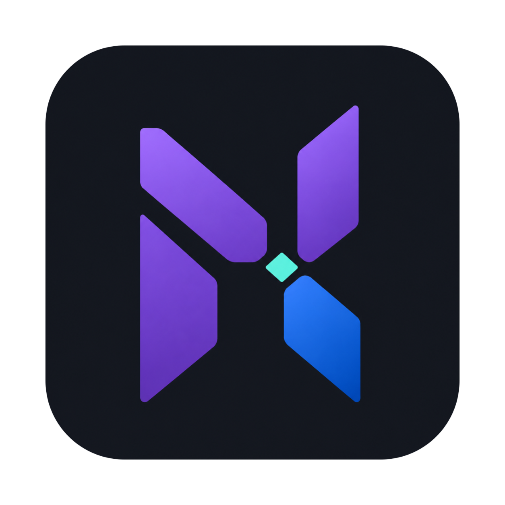
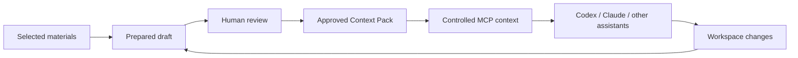

<p align="center">
  
</p>

<h1 align="center">Nexus</h1>

<p align="center">
  A local-first context compiler for coding assistants on macOS.
</p>

<p align="center">
  <a href="https://github.com/NoraSoong/Nexus/releases/tag/v0.1.0-preview.1">Download Developer Preview</a>
  ·
  <a href="README.zh.md">中文说明</a>
  ·
  <a href="https://github.com/NoraSoong/Nexus/issues">Issues</a>
</p>

<p align="center">
  <a href="https://github.com/NoraSoong/Nexus/actions/workflows/verify.yml"></a>
  <a href="https://github.com/NoraSoong/Nexus/releases"></a>
  <a href="LICENSE"></a>
  
</p>

> **Status:** pre-alpha Apple Silicon Developer Preview. The preview DMG includes a private Node.js Runtime and MCP Helper. It is not Developer ID signed or notarized.

Nexus helps a coding assistant understand **what you are working on, which materials are authoritative, what remains uncertain, and what changed in the code workspace**.

It turns selected requirements, API examples, SQL, logs, source files, and notes into a short, reviewable, source-backed **Context Pack**. After you approve it, Codex, Claude, and other MCP-compatible assistants can read the current context without receiving every raw material by default.

Nexus does not replace your coding assistant. The assistant explores and edits code; Nexus keeps the work context clear, bounded, and portable between tools and workspaces.

## The Core Loop



Model output is always a draft. It changes the context exposed through MCP only after explicit user approval.

## Why Nexus

Opening another assistant conversation preserves chat history, but it does not reliably preserve:

- which source is authoritative now;
- which claims are facts, assumptions, or unresolved questions;
- which local materials the assistant may read;
- which worktree belongs to which parallel Work;
- what changed since the last confirmed context.

Nexus is the context layer between your development materials, code workspaces, and existing coding assistants. It is intentionally not an agent runner, a full Git client, or a project-management system.

## What You Can Do Today

- Create and switch lightweight Work items from a native SwiftUI Mac app and menu bar;
- add local files or pasted text and choose which materials assistants may read;
- prepare a compact Context Pack with DeepSeek or OpenAI;
- review facts, constraints, acceptance criteria, assumptions, questions, and sources before approval;
- keep material freshness separate from code activity;
- see commits and working-tree changes since the confirmed context;
- associate an existing code directory or create a standard isolated Git worktree;
- pin different worktrees from one repository to different Work items;
- expose one compact, read-only context through a bundled stdio MCP Helper;
- read visible text materials on demand with bounded, paginated access.

Nexus never switches, stashes, resets, commits, merges, pushes, or deletes user code automatically.

## Download

For the current preview, download **[Nexus-0.1.0-preview.1-arm64.dmg](https://github.com/NoraSoong/Nexus/releases/download/v0.1.0-preview.1/Nexus-0.1.0-preview.1-arm64.dmg)** from the [GitHub Release](https://github.com/NoraSoong/Nexus/releases/tag/v0.1.0-preview.1).

Requirements:

- Apple Silicon Mac;
- macOS 14 or later;
- no separate Node.js installation is required.

The preview is unsigned and notarized neither by Developer ID nor by the Mac App Store. macOS may require the usual local-preview confirmation when opening it for the first time.

## Try It

1. Open Nexus from Applications and open its main window from the menu bar.
2. Create a Work with a title and a one-sentence goal.
3. Add a few relevant files or a pasted text note. Mark only the materials the assistant may read.
4. Choose **Prepare Current Work**, inspect the material selection, and review the generated draft.
5. Answer or correct the questions, then explicitly approve the Context Pack.
6. Connect your MCP client once. The client can then read the current context through the stable Helper path.
7. When code changes later, Nexus shows them as evidence for a future update. It does not silently rewrite the confirmed context.

## MCP Setup

The Developer Preview installs a stable Helper path on first launch. It includes its own Node.js Runtime, so users do not need Node.js or a SQLite CLI:

```text
~/Library/Application Support/Nexus/bin/nexus-mcp
```

For Codex:

```bash
codex mcp add nexus \
  -- "$HOME/Library/Application Support/Nexus/bin/nexus-mcp"
```

To pin a client to a particular code directory:

```bash
codex mcp add nexus-workspace \
  -- "$HOME/Library/Application Support/Nexus/bin/nexus-mcp" \
  --workspace /path/to/worktree
```

The preferred read-only tools are:

- `get_current_development_context`: one compact object containing confirmed context, material freshness, and workspace activity;
- `read_context_material`: bounded, on-demand reads of visible text materials.

Nexus exposes no context while the app is not running or assistant access is paused. See the [assistant rules example](docs/agent-rules.md) for guidance on when an assistant should consult Nexus.

Diagnostics:

```bash
"$HOME/Library/Application Support/Nexus/bin/nexus-mcp" --version
"$HOME/Library/Application Support/Nexus/bin/nexus-mcp" --doctor
```

## Parallel Workspaces

One Git directory can only have one checked-out branch at a time. For parallel Work items in one repository, create separate directories instead:

```text
Work A -> worktree A -> MCP binding A -> Context Pack A
Work B -> worktree B -> MCP binding B -> Context Pack B
```

From a Work's code section, choose **Create Isolated Code Directory**, review the base branch, new branch, and destination, then confirm. Open each resulting directory in your preferred development tool: IDEA, VS Code, Xcode, Cursor, or a terminal. Nexus does not install an editor plugin or automatically switch branches.

Archiving or deleting a Work does not delete a Nexus-created directory or Git branch. Unlinking removes only the Nexus binding; code remains on disk.

## Data and Security

- Product data and MCP projections stay under `~/Library/Application Support/Nexus` by default;
- only explicitly added or associated files and repositories are read;
- hidden materials cannot be read through MCP;
- model calls require a direct user action;
- provider credentials stay in the macOS Keychain and never enter SQLite, MCP output, logs, or Context Packs;
- failed, cancelled, or unapproved drafts never change the current Context Pack;
- unsupported, binary, invalidly encoded, empty, and oversized files are excluded with distinct reasons;
- Git reads status, commit summaries, and bounded change evidence; it does not manage the user's code lifecycle.

## Build From Source

Source development requires macOS 14 or later, Xcode 26.5 / Swift 6.3.2, Node.js `v26.5.0`, and npm `11.17.0`.

```bash
swift build
swift test

cd adapters/mcp
npm ci
npm run build
```

Build and verify the Apple Silicon preview package:

```bash
scripts/build-preview.sh
scripts/verify-preview.sh
```

The build downloads and verifies the pinned official Node.js Runtime, then embeds it in the generated app. Runtime files and generated `dist/` output are not committed.

## Documentation

- [Architecture](docs/architecture.md)
- [Development guide](docs/development.md)
- [Developer Preview release notes](docs/release.md)
- [Contributing](CONTRIBUTING.md)
- [Security policy](SECURITY.md)
- [Assistant rules example](docs/agent-rules.md)
- [中文说明](README.zh.md)

## License

Nexus is licensed under the [Apache License 2.0](LICENSE).
