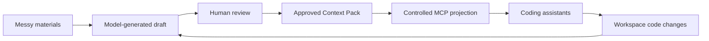

# Nexus

[中文说明](README.zh.md)

Nexus is a local-first trusted work-context layer for coding assistants on macOS.

It turns requirements, API examples, SQL, logs, source files, and human notes into a concise, reviewable, source-backed **Context Pack**, then carries later code changes forward as separate evidence. Once approved, that context is available to coding assistants such as Codex and Claude through MCP without injecting every raw material by default.

> Status: pre-alpha local prototype suitable for dogfooding. A production App Bundle, private Helper runtime, signing, notarization, and DMG are not complete yet.

## Why Nexus

Opening another assistant conversation preserves chat history, but it does not reliably answer:

- which source is authoritative now;
- which claims are facts, assumptions, or unresolved questions;
- which local materials an assistant may read;
- which parallel work item belongs to each worktree;
- how to keep growing context short and traceable.

Nexus does not manage agents or take over Git. It manages the work context between them that otherwise becomes lost, ambiguous, or stale:



Model output is always a draft. It affects MCP only after explicit approval.

## Current Capabilities

- Native SwiftUI Mac app with a menu-bar entry and quick switching;
- Work creation, editing, archive, restore, and delete flows;
- local files and pasted text with per-material assistant visibility;
- DeepSeek and OpenAI preparation with provider-specific keys in macOS Keychain;
- source-backed objectives, scope, facts, constraints, acceptance criteria, assumptions, and questions;
- Context Pack review, diff, approval, and source-change freshness;
- Git repository, branch, and existing worktree association, plus commit and working-tree activity since the confirmed baseline;
- separate material freshness and code activity, so ordinary coding does not make requirement context stale;
- workspace bindings that pin different worktrees from one repository to different Work items;
- read-only stdio MCP Helper with layered confirmed context, source freshness, workspace activity, and paginated material reads;
- no Nexus tools while the app is not running or assistant access is paused.

Nexus does not run coding agents, decide implementation strategy, or automatically create, merge, or delete worktrees.

## Requirements

Current development baseline:

- macOS 14 or later;
- Xcode 26.5 / Swift 6.3.2;
- Node.js `v26.5.0`, pinned in [`.node-version`](.node-version);
- npm `11.17.0`.

The MCP Helper uses `node:sqlite`; it does not depend on the system SQLite CLI or a third-party native addon.

## Build and Run

Build and test Swift:

```bash
swift build
swift test
```

Build the MCP Helper:

```bash
cd adapters/mcp
npm ci
npm run build
```

Run the development Mac app:

```bash
.build/debug/NexusMac
```

Nexus stores local data in:

```text
~/Library/Application Support/Nexus
```

Users do not configure a database path or environment variable. `NEXUS_HOME` exists only for isolated development tests.

## Basic Workflow

1. Start Nexus and open its main window from the menu bar.
2. Create a Work item with a title and one-sentence goal.
3. Optionally associate a local Git checkout or existing worktree.
4. Drop relevant files or add pasted text.
5. Choose which materials assistants may read.
6. Add an optional note when the materials do not capture recent progress or caveats.
7. Choose **Prepare Current Work** and review the included, excluded, and truncated sources.
8. Review the generated draft, answer critical questions, or correct the wording.
9. Approve it explicitly. The main **Current Context** card updates immediately, and assistants read that version.
10. Later commits or uncommitted changes appear as code activity. They update confirmed context only after another explicit preparation and approval.

An approved Context Pack can be expanded in the main workspace to inspect its full content and sources. The optional note is only an input to future preparation, not a structured status form.

## MCP Helper

Install the development helper shim:

```bash
scripts/install-helper.sh
```

Default location:

```text
~/Library/Application Support/Nexus/bin/nexus-mcp
```

Check the Helper:

```bash
"$HOME/Library/Application Support/Nexus/bin/nexus-mcp" --version
"$HOME/Library/Application Support/Nexus/bin/nexus-mcp" --doctor
```

Example Codex configuration:

```bash
codex mcp add nexus \
  -- "$HOME/Library/Application Support/Nexus/bin/nexus-mcp"
```

Pin a client to an existing worktree:

```bash
codex mcp add nexus-worktree \
  -- "$HOME/Library/Application Support/Nexus/bin/nexus-mcp" \
  --workspace /path/to/worktree
```

Preferred entry points:

- `get_current_development_context`: one compact object split into `confirmed_context`, `source_freshness`, and `workspace_activity`;
- `read_context_material`: on-demand reads for visible text materials in the resolved binding.

Legacy fine-grained tools remain for compatibility. Assistants should not call Nexus by default when the current conversation is already sufficient. See [docs/agent-rules.md](docs/agent-rules.md).

## Data and Security

- Data is local by default;
- Nexus reads only explicitly added or associated files and repositories;
- MCP is currently read-only;
- hidden materials cannot be read through MCP;
- model calls require an explicit user action;
- API keys are not stored in SQLite or exposed through MCP;
- failed, cancelled, or unapproved drafts never change the current Context Pack;
- Git integration reads state, commit summaries, and budgeted change evidence but does not run `checkout`, `stash`, `reset`, or commit operations.

## Documentation

- [Architecture](docs/architecture.md)
- [Development guide](docs/development.md)
- [Contributing](CONTRIBUTING.md)
- [Security policy](SECURITY.md)
- [Assistant rules example](docs/agent-rules.md)

## License

Licensed under the [Apache License 2.0](LICENSE).
