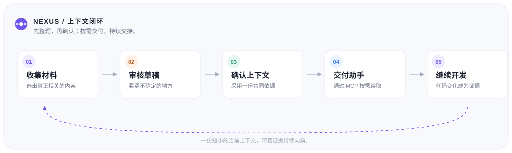
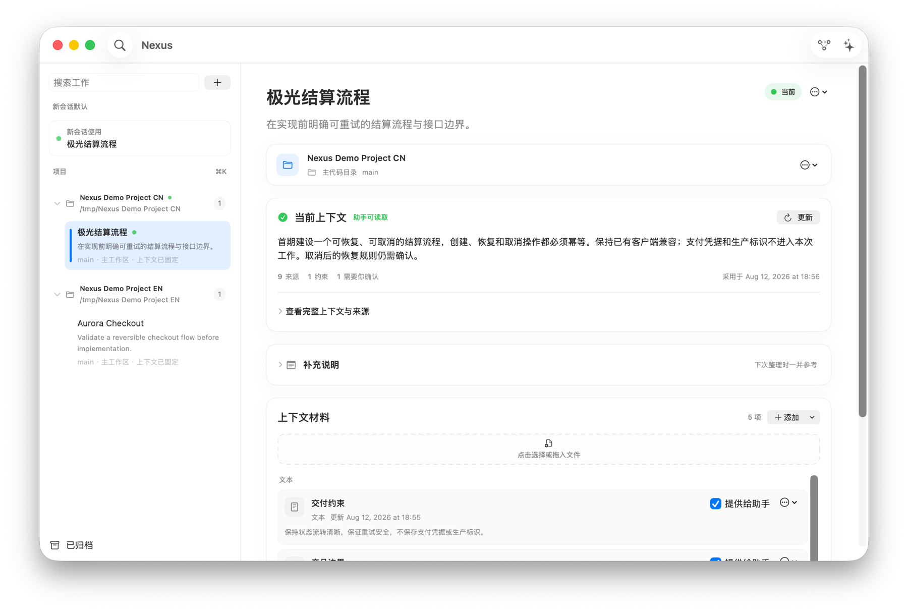

<p align="center">
  
</p>

<h1 align="center">Nexus</h1>

<p align="center">
  面向编码助手的本地工作上下文编译器。
</p>

<p align="center">
  <a href="https://github.com/NoraSoong/Nexus/releases/tag/v0.1.0-preview.1">下载 Developer Preview</a>
  ·
  <a href="README.md">English README</a>
  ·
  <a href="https://github.com/NoraSoong/Nexus/issues">反馈问题</a>
</p>

<p align="center">
  <a href="https://github.com/NoraSoong/Nexus/actions/workflows/verify.yml"></a>
  <a href="https://github.com/NoraSoong/Nexus/releases"></a>
  <a href="LICENSE"></a>
  
</p>

> **当前状态：** pre-alpha Apple Silicon Developer Preview。预览版 DMG 已包含私有 Node.js Runtime 和 MCP Helper，但暂未进行 Developer ID 签名和公证。

Nexus 帮助编码助手理解：**你正在做什么、哪些材料是依据、哪些内容仍不确定，以及代码工作区发生了什么变化**。

它把用户选定的需求说明、接口样例、SQL、日志、代码文件和补充说明，整理成一份短小、可审核、带来源的 **Context Pack**。用户确认后，Codex、Claude 以及其他支持 MCP 的助手可以读取当前上下文，而不必默认接收全部原始材料。

Nexus 不替代编码助手。助手负责探索和修改代码；Nexus 负责让工作上下文清楚、受控、可追溯，并能在不同助手和代码工作区之间复用。

## 核心闭环

<p align="center">
  
</p>

## 界面示例

<p align="center">
  
</p>

模型输出始终是草稿。只有用户明确采用后，Context Pack 才会成为当前 Work 的上下文并通过 MCP 暴露。

## Nexus 解决什么问题

多开一个助手对话可以保存聊天记录，但不能可靠回答：

- 当前应该以哪份材料为准；
- 哪些内容是事实、假设或待确认问题；
- 哪些本地材料允许助手读取；
- 同一仓库的多个并行工作区分别对应哪项需求；
- 自上次确认上下文后，代码发生了什么变化。

Nexus 位于开发材料、代码工作区和现有编码助手之间。它不是 Agent Runner、完整 Git 客户端或项目管理系统。

## 当前可以做什么

- 使用原生 SwiftUI Mac App 和菜单栏创建、切换轻量 Work；
- 添加本地文件或粘贴文本，并逐项控制助手是否可见；
- 使用 DeepSeek 或 OpenAI 整理 Context Pack；
- 在采用前审核事实、约束、验收条件、假设、问题和来源；
- 将材料新鲜度与代码活动分开处理；
- 查看确认上下文之后的提交和工作区变化；
- 关联已有代码目录，或创建标准 Git 隔离工作区；
- 将同一仓库的不同 worktree 固定到不同 Work；
- 通过内置的只读 stdio MCP Helper 暴露一份紧凑上下文；
- 对可见文本材料进行有上限、可分页的按需读取。

Nexus 不会自动切换、stash、reset、提交、合并、推送或删除用户代码。

## 下载

当前预览版可以从 [GitHub Release](https://github.com/NoraSoong/Nexus/releases/tag/v0.1.0-preview.1) 下载：

**[下载 Nexus-0.1.0-preview.1-arm64.dmg](https://github.com/NoraSoong/Nexus/releases/download/v0.1.0-preview.1/Nexus-0.1.0-preview.1-arm64.dmg)**

环境要求：

- Apple Silicon Mac；
- macOS 14 或更高版本；
- 普通使用不需要单独安装 Node.js。

当前预览版未进行 Developer ID 签名、公证或 Mac App Store 发布。首次打开时，macOS 可能会要求按系统提示确认运行本地预览应用。

## 快速体验

1. 从 Applications 打开 Nexus，再从菜单栏打开主窗口。
2. 新建一个 Work，填写标题和一句话目标。
3. 添加几份相关文件或一段粘贴文本，只勾选允许助手读取的材料。
4. 点击“整理当前工作”，检查本次发送、排除和截取的材料。
5. 审核整理结果，回答关键问题或修正文案，然后明确采用 Context Pack。
6. 连接一次 MCP 客户端，之后助手可以通过稳定 Helper 路径读取当前上下文。
7. 后续代码变化会作为证据显示；Nexus 不会静默改写已确认的上下文。

## MCP 配置

通过 Developer Preview DMG 安装后，首次启动 Nexus 会自动准备内置 Helper。普通用户不需要安装 Node.js 或 SQLite CLI：

```text
~/Library/Application Support/Nexus/bin/nexus-mcp
```

Codex 配置示例：

```bash
codex mcp add nexus \
  -- "$HOME/Library/Application Support/Nexus/bin/nexus-mcp"
```

固定到某个代码目录：

```bash
codex mcp add nexus-workspace \
  -- "$HOME/Library/Application Support/Nexus/bin/nexus-mcp" \
  --workspace /path/to/worktree
```

推荐入口：

- `get_current_development_context`：返回一份紧凑对象，区分已确认上下文、材料新鲜度和工作区活动；
- `read_context_material`：按需读取当前绑定中可见的文本材料。

Nexus 未运行或助手读取被暂停时，不会暴露上下文。助手何时应该读取 Nexus，可参考[助手规则示例](docs/agent-rules.zh.md)。

诊断命令：

```bash
"$HOME/Library/Application Support/Nexus/bin/nexus-mcp" --version
"$HOME/Library/Application Support/Nexus/bin/nexus-mcp" --doctor
```

## 并行代码工作区

一个 Git 目录同一时间只能检出一个分支。同一仓库要并行处理多个 Work，需要多个独立代码目录：

```text
Work A → worktree A → MCP binding A → Context Pack A
Work B → worktree B → MCP binding B → Context Pack B
```

在 Work 的代码区域选择“创建隔离代码目录”，确认基准分支、新分支和目标路径。创建后，把得到的目录分别用你常用的开发工具打开，例如 IDEA、VS Code、Xcode、Cursor 或终端。Nexus 不安装编辑器插件，也不会自动切换分支。

归档或删除 Work 不会删除 Nexus 创建的目录或 Git 分支。解除关联只移除 Nexus 的绑定，代码仍保留在本机。

## 数据与安全

- 产品数据和 MCP 投影默认保存在 `~/Library/Application Support/Nexus`；
- 只读取用户明确添加或关联的文件与仓库；
- 隐藏材料不能通过 MCP 读取；
- 模型调用只由用户主动触发；
- 服务商凭据保存在 macOS 钥匙串，不写入 SQLite、MCP 输出、日志或 Context Pack；
- 失败、取消或未采用的草稿不会改变当前 Context Pack；
- 空文件、二进制、无效编码、不支持类型和超大文件会以不同原因排除；
- Git 只读取状态、提交摘要和受预算控制的变更证据，不接管用户代码生命周期。

## 从源码构建

源码开发需要 macOS 14 或更高版本、Xcode 26.5 / Swift 6.3.2、Node.js `v26.5.0` 和 npm `11.17.0`。

```bash
swift build
swift test

cd adapters/mcp
npm ci
npm run build
```

构建并验证 Apple Silicon 预览包：

```bash
scripts/build-preview.sh
scripts/verify-preview.sh
```

构建过程会下载并校验固定版本的官方 Node.js Runtime，再嵌入生成的 App。Runtime 文件和生成的 `dist/` 输出不会提交到仓库。

## 项目文档

- [架构说明](docs/architecture.zh.md)
- [开发指南](docs/development.zh.md)
- [Developer Preview 发布说明](docs/release.zh.md)
- [参与贡献](CONTRIBUTING.md)
- [安全策略](SECURITY.md)
- [助手规则示例](docs/agent-rules.zh.md)
- [English README](README.md)

## License

本项目使用 [Apache License 2.0](LICENSE)。
