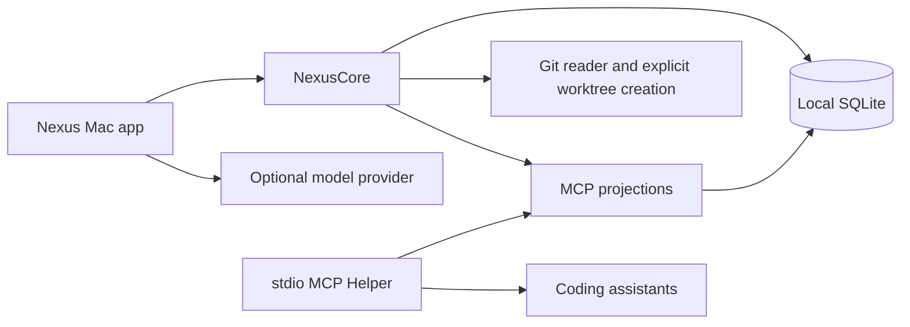

# Architecture

Nexus is a local-first macOS application that turns selected development materials into a reviewed Context Pack for coding assistants. It keeps the product boundary deliberately narrow: Nexus manages context and evidence; coding assistants manage code exploration and implementation.

## Components

### NexusMac

The SwiftUI app provides the menu bar, Work navigation, material selection, review flow, and assistant-access controls. It coordinates state but does not own persistence or context rules.

### NexusCore

The Swift package owns domain types, SQLite storage, material extraction, Context Pack review, Git activity snapshots, and MCP projection generation. `ProjectionStore` remains the compatibility facade while Context Pack persistence, binding persistence, and projection publication are isolated internal components. Core is independent of SwiftUI so behavior can be tested without a running app.

### MCP Helper

The TypeScript helper runs over stdio and reads stable projections from SQLite. It resolves an explicit or workspace binding, enforces assistant access, and exposes a compact current-context result plus streamed, paginated reads of visible text materials. It does not query Core domain tables directly or load an entire source file into memory.

## Context Lifecycle

1. A user adds materials and optionally a short note to a Work.
2. Nexus extracts only selected, supported text within a fixed length budget.
3. A model may produce a draft; it is never exposed to assistants automatically.
4. The user reviews and approves a Context Pack.
5. Core atomically publishes a projection for the approved Pack.
6. Assistants read that projection through MCP and request visible source material only when needed.

Text extraction recognizes UTF-8 and UTF-16 LE/BE with or without a BOM. A source is capped at 40,000 characters, a preparation request at 120,000 characters, and an original file at 64 MiB. Larger files are excluded before their body is read. Truncated sources preserve their beginning and end and remain explicitly marked as truncated.

If a provider stops at its output limit, Nexus performs one compact retry. Authentication, rate-limit, transport, cancellation, and refusal errors are not retried. Neither attempt affects MCP until the user approves the result.

Material freshness and workspace activity are intentionally separate. A code change is evidence for a later update; it does not automatically rewrite confirmed requirements or mark them incorrect.

## Local Data and Trust Boundaries

- Product data and projections live under the user's Application Support directory.
- Provider credentials are stored in the macOS Keychain, never SQLite or MCP output.
- Materials are opt-in for assistant visibility; hidden materials remain unreadable through MCP.
- Model calls require a direct user action.
- MCP returns no context while assistant access is paused or the app runtime is not active.
- Git status reads are read-only. After an explicit user confirmation, Core may run one standard `git worktree add` and record the binding; Nexus never checks out, commits, stashes, resets, rebases, merges, or deletes user code.

## Code Workspaces

One Work is bound to one normalized code directory. One Git repository can serve multiple Works through separate worktrees. Existing directories are recorded as `external`; directories created by Nexus are recorded as `nexus_created` with their base ref and creation HEAD. Switching the selected Work in the main window never changes an already-bound MCP workspace.

Before creating a directory, Core validates the repository, base ref, branch name, destination, and dirty state. A dirty base requires explicit confirmation and the new directory starts from HEAD without copying uncommitted changes. If persistence fails after Git creates the worktree, Nexus only attempts to clean up that newly created directory.

## Deliberate Non-Goals

Nexus is not an agent runner, full Git client, cloud knowledge base, or project-management system. Its job is to make the context delivered to existing coding assistants shorter, clearer, reviewed, and traceable while giving parallel Work items clear code-directory boundaries.
