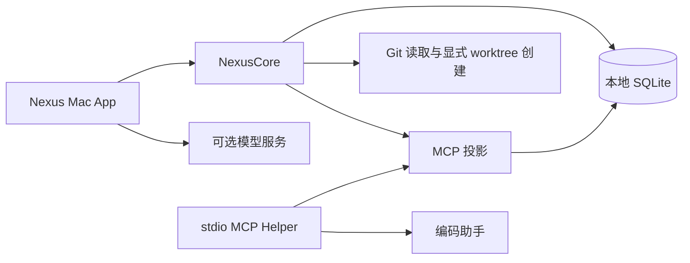

# 架构说明

Nexus 是一个本地优先的 macOS 应用。它把用户选择的研发材料整理为可审核的 Context Pack，供编码助手读取。产品边界保持克制：Nexus 管理上下文和证据；编码助手负责阅读代码与实施开发。

## 组件

### NexusMac

SwiftUI App 负责菜单栏、Work 导航、材料选择、审核流程和助手读取开关。它协调界面状态，但不承载持久化和上下文规则。

### NexusCore

Swift Package 负责领域类型、SQLite、材料提取、Context Pack 审核、Git 活动快照和 MCP 投影生成。`ProjectionStore` 保留为兼容门面，Context Pack 持久化、Binding 持久化和投影发布由独立内部组件承担。它不依赖 SwiftUI，因此无需启动 App 就能测试核心行为。

### MCP Helper

TypeScript Helper 使用 stdio 运行，并从 SQLite 读取稳定投影。它解析显式或工作区绑定、执行助手访问控制，并提供紧凑的当前上下文与可见文本材料的流式分页读取。它不会直接查询 Core 的领域表，也不会把整份来源文件一次载入内存。

## 上下文生命周期

1. 用户向 Work 添加材料，并可补充一段简短说明。
2. Nexus 只提取被选中且支持的文本，并遵守长度预算。
3. 模型可以生成草稿，但草稿不会自动暴露给助手。
4. 用户审核并采用 Context Pack。
5. Core 原子发布该 Pack 的 MCP 投影。
6. 助手通过 MCP 读取投影，只在需要时读取可见材料原文。

文本提取支持 UTF-8，以及带或不带 BOM 的 UTF-16 LE/BE。单份来源最多 40,000 字符，单次整理最多 120,000 字符，原文件硬性上限为 64 MiB；超大文件会在读取正文前排除。被截取的来源保留开头和结尾，并始终明确标记。

模型达到输出上限时，Nexus 只进行一次压缩重试。认证、限流、网络、取消和拒绝错误不会重试；两次请求都必须等用户采用后才会影响 MCP。

材料新鲜度与工作区活动刻意分开。代码变化只是下一次更新的证据，不会自动改写已确认的需求，也不会自动判定需求失效。

## 本地数据与信任边界

- 产品数据和投影保存在用户的 Application Support 目录。
- 服务商凭据保存在 macOS 钥匙串，不会写入 SQLite 或 MCP 输出。
- 每份材料都由用户决定是否对助手可见；隐藏材料不能通过 MCP 读取。
- 模型调用必须由用户主动发起。
- 助手读取被暂停或 App 运行状态失效时，MCP 不返回上下文。
- Git 日常状态读取是只读的。用户明确确认“创建隔离代码目录”后，Core 只执行标准 `git worktree add` 并记录绑定；Nexus 不会 checkout、提交、stash、reset、rebase、合并或删除用户代码。

## 代码工作区

一个 Work 可以绑定一个规范化代码目录，一个 Git 仓库可以通过多个 worktree 绑定多个 Work。已有目录标记为 `external`；Nexus 创建的目录标记为 `nexus_created`，并记录基准分支和创建时的 HEAD。主窗口切换 Work 不会改变已经绑定的 MCP workspace。

创建隔离目录时，Core 会在执行 Git 前校验仓库、基准分支、分支名、目标路径和未提交修改。脏目录只有在用户明确确认后才会从当前 HEAD 创建，未提交修改不会被复制。数据库写入失败时只尝试清理本次刚创建的 worktree，不触碰已有代码和分支。

## 明确不做的事

Nexus 不是 Agent Runner、完整 Git 客户端、云端知识库或项目管理系统。它的任务是让交给现有编码助手的上下文更短、更清楚、经过审核并且可追溯，并为并行 Work 提供清晰的代码目录边界。
